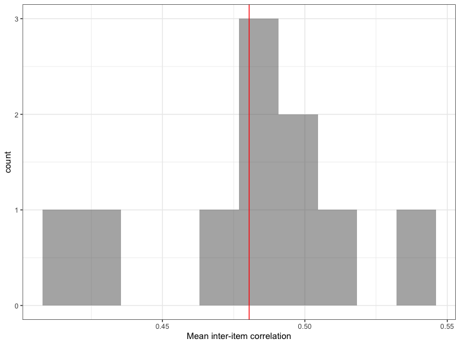
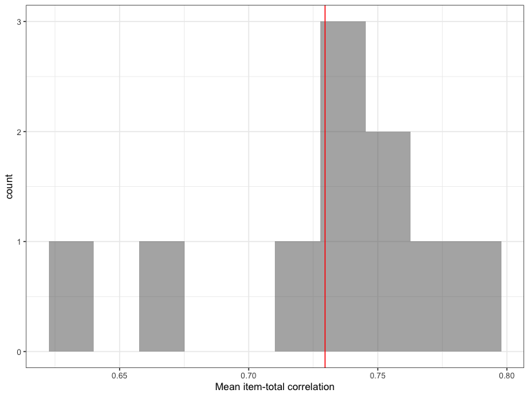

Carol requested that we figure out how to run a Cronbach's Alpha analysis. I found an exercise on the [R Bloggers](https://www.r-bloggers.com/five-ways-to-calculate-internal-consistency/) webiste that shows how to do this along with some other evaluations of internal consistency. So let's give it a shot!

First step as always is to set your working directory/R Studio Project, whatever system you have now (hopefully) become confortable with to get started in R. 

##More Data Import Methods!

To start, we need to import the dataset and R Bloggers shows us another way of doing this: using R to download the dataset directly to your working directory and then opening it with read.table. I have to confess that I don't do this in my own work, but it's a fantastic practice, especially if you are downloading from a permanent repository service like Michigan's ICPSR, Harvard's IQSS, or even github. Some of these have their own packaged for even easier and more direct imports of their data. 


```r
temp <- tempfile()
download.file("http://personality-testing.info/_rawdata/BIG5.zip", temp, mode="wb")
d <- read.table(unz(temp, "BIG5/data.csv"), header = TRUE, sep="\t")
unlink(temp); rm(temp)
```

This is a little more complicated than it needed to be as it cleaned up some of the unnecessary "temp" items along the way.

The dataset you can see is quite large! Try working with this in Excel! (not). The dataset is based on 19719 respondents to a Big Five personality test as used in psychometrics. Respondents were asked 50 questions on a 5 point Likert scale, 10 questions are associated with each of the Big Five personality traits.

##Cleaning the Data
For the purposes of this exercise, we are going to focus just on the 10 questions related to Introversion versus Extraversion (columns E1 through E10 in the dataset) and use only the first 500 observations.

```r
d <- d[1:500, paste0("E", 1:10)]
str(d)
```

```
## 'data.frame':	500 obs. of  10 variables:
##  $ E1 : int  4 2 5 2 3 1 5 4 3 1 ...
##  $ E2 : int  2 2 1 5 1 5 1 3 1 4 ...
##  $ E3 : int  5 3 1 2 3 2 5 5 5 2 ...
##  $ E4 : int  2 3 4 4 3 4 1 3 1 5 ...
##  $ E5 : int  5 3 5 3 3 1 5 5 5 2 ...
##  $ E6 : int  1 3 1 4 1 3 1 1 1 4 ...
##  $ E7 : int  4 1 1 3 3 2 5 4 5 1 ...
##  $ E8 : int  3 5 5 4 1 4 4 3 2 4 ...
##  $ E9 : int  5 1 5 4 3 1 4 4 5 1 ...
##  $ E10: int  1 5 1 5 5 5 1 3 3 5 ...
```


Here are what those questions are (or rather, statements to which the respondent answered on the Likert Scale ranging from Strongly agree to Strongly Disagree);

E1 I am the life of the party.
E2 I don’t talk a lot.
E3 I feel comfortable around people.
E4 I keep in the background.
E5 I start conversations.
E6 I have little to say.
E7 I talk to a lot of different people at parties.
E8 I don’t like to draw attention to myself.
E9 I don’t mind being the center of attention.
E10 I am quiet around strangers.

A quick problem is that the questions measure the underlying trait of Extroversion in different directions. Specifically, the even questions are associated with introversion while the odd questions are associated with extroversion. Here's some code to do just that:


```r
d[, paste0("E", c(2, 4, 6, 8, 10))] <- 6 - d[, paste0("E", c(2, 4, 6, 8, 10))]
```

Think for a minute about what this line of code is doing and how it's doing it in case you need to do something similar in the future.

##Inter-Item Correlations

A quick first step to understanding this data might be to look at the correlation matrix.


```r
#install.packages("corrr")
library(corrr)
library(dplyr)
```

```
## 
## Attaching package: 'dplyr'
```

```
## The following objects are masked from 'package:stats':
## 
##     filter, lag
```

```
## The following objects are masked from 'package:base':
## 
##     intersect, setdiff, setequal, union
```

```r
d %>% correlate()
```

```
## 
## Correlation method: 'pearson'
## Missing treated using: 'pairwise.complete.obs'
```

```
## # A tibble: 10 x 11
##    rowname     E1     E2     E3     E4     E5     E6     E7     E8     E9
##    <chr>    <dbl>  <dbl>  <dbl>  <dbl>  <dbl>  <dbl>  <dbl>  <dbl>  <dbl>
##  1 E1      NA      0.453  0.500  0.524  0.538  0.366  0.636  0.450  0.528
##  2 E2       0.453 NA      0.479  0.555  0.592  0.569  0.473  0.379  0.396
##  3 E3       0.500  0.479 NA      0.493  0.616  0.330  0.568  0.418  0.475
##  4 E4       0.524  0.555  0.493 NA      0.512  0.471  0.500  0.451  0.463
##  5 E5       0.538  0.592  0.616  0.512 NA      0.500  0.621  0.385  0.485
##  6 E6       0.366  0.569  0.330  0.471  0.500 NA      0.373  0.331  0.328
##  7 E7       0.636  0.473  0.568  0.500  0.621  0.373 NA      0.403  0.528
##  8 E8       0.450  0.379  0.418  0.451  0.385  0.331  0.403 NA      0.598
##  9 E9       0.528  0.396  0.475  0.463  0.485  0.328  0.528  0.598 NA    
## 10 E10      0.491  0.449  0.500  0.523  0.553  0.414  0.518  0.429  0.457
## # … with 1 more variable: E10 <dbl>
```

Next, we might want to take a look at the average correlation in each column and the average of those averages (i.e. the average inter-item correlation:


```r
inter_item <- d %>% correlate() %>% select(-rowname) %>% colMeans(na.rm = TRUE)
```

```
## 
## Correlation method: 'pearson'
## Missing treated using: 'pairwise.complete.obs'
```

```r
inter_item
```

```
##        E1        E2        E3        E4        E5        E6        E7 
## 0.4983678 0.4827948 0.4866458 0.4991764 0.5334524 0.4090418 0.5133091 
##        E8        E9       E10 
## 0.4270190 0.4731896 0.4814496
```

```r
mean(inter_item)
```

```
## [1] 0.4804446
```

The lesson I'm drawing from also provides code for how to plot a histogram of the inter-item correlations. It uses a graphics package that we haven't discussed yet, but I leave the code here anyway:


```r
library(ggplot2)

data.frame(inter_item) %>% 
  ggplot(aes(x = inter_item)) +
    geom_histogram(bins = 10, alpha = .5) +
    geom_vline(xintercept = mean(inter_item), color = "red") +
    xlab("Mean inter-item correlation") +
    theme_bw()
```

<!-- -->

##Item-Total Correlation

Next, we can calculate an average "score" for each respondent on the Extroversion measure, and then examine the correlation between each item and that score:


```r
d$score <- rowMeans(d)
item_total <- d %>% correlate() %>% focus(score)
```

```
## 
## Correlation method: 'pearson'
## Missing treated using: 'pairwise.complete.obs'
```

```r
item_total
```

```
## # A tibble: 10 x 2
##    rowname score
##    <chr>   <dbl>
##  1 E1      0.752
##  2 E2      0.730
##  3 E3      0.735
##  4 E4      0.749
##  5 E5      0.795
##  6 E6      0.637
##  7 E7      0.777
##  8 E8      0.664
##  9 E9      0.727
## 10 E10     0.731
```

```r
mean(item_total$score)
```

```
## [1] 0.7295695
```

```r
item_total %>% 
  ggplot(aes(x = score)) +
    geom_histogram(bins = 10, alpha = .5) +
    geom_vline(xintercept = mean(item_total$score), color = "red") +
    xlab("Mean item-total correlation") +
    theme_bw()
```

<!-- -->

##Cronbach's Alpha

And now, what we all came for: Cronbach's Alpha. To do this, the lesson recommends the function "alpha" from the "psych" package. In the code below, notice that we first remove the score column we made earlier, then we use a special notation in calling the alpha function to show that we want the alpha function from the psych package as opposed to the one in the ggplot2 package (the ugliness of dealing with software developed by an open source community...but hey, it's free!)


```r
d$score <- NULL
psych::alpha(d)
```

```
## 
## Reliability analysis   
## Call: psych::alpha(x = d)
## 
##   raw_alpha std.alpha G6(smc) average_r S/N    ase mean   sd median_r
##        0.9       0.9     0.9      0.48 9.2 0.0065    3 0.98     0.49
## 
##  lower alpha upper     95% confidence boundaries
## 0.89 0.9 0.91 
## 
##  Reliability if an item is dropped:
##     raw_alpha std.alpha G6(smc) average_r S/N alpha se  var.r med.r
## E1       0.89      0.89    0.89      0.48 8.2   0.0073 0.0064  0.48
## E2       0.89      0.89    0.89      0.48 8.3   0.0072 0.0065  0.49
## E3       0.89      0.89    0.89      0.48 8.3   0.0073 0.0062  0.48
## E4       0.89      0.89    0.89      0.48 8.2   0.0073 0.0074  0.48
## E5       0.89      0.89    0.89      0.47 7.9   0.0075 0.0056  0.47
## E6       0.90      0.90    0.90      0.50 8.9   0.0068 0.0044  0.50
## E7       0.89      0.89    0.89      0.47 8.1   0.0075 0.0056  0.48
## E8       0.90      0.90    0.90      0.49 8.8   0.0069 0.0056  0.50
## E9       0.89      0.89    0.89      0.48 8.4   0.0071 0.0063  0.49
## E10      0.89      0.89    0.89      0.48 8.3   0.0072 0.0073  0.48
## 
##  Item statistics 
##       n raw.r std.r r.cor r.drop mean  sd
## E1  500  0.75  0.75  0.72   0.68  2.6 1.3
## E2  500  0.73  0.73  0.70   0.66  3.2 1.3
## E3  500  0.74  0.74  0.70   0.67  3.3 1.3
## E4  500  0.75  0.75  0.72   0.68  2.8 1.3
## E5  500  0.79  0.80  0.78   0.74  3.3 1.3
## E6  500  0.64  0.64  0.59   0.55  3.6 1.3
## E7  500  0.78  0.77  0.75   0.70  2.8 1.5
## E8  500  0.66  0.66  0.61   0.58  2.7 1.3
## E9  500  0.73  0.72  0.68   0.64  3.1 1.5
## E10 500  0.73  0.73  0.69   0.66  2.3 1.3
## 
## Non missing response frequency for each item
##        1    2    3    4    5 miss
## E1  0.28 0.23 0.23 0.16 0.10    0
## E2  0.12 0.21 0.22 0.21 0.23    0
## E3  0.09 0.20 0.25 0.22 0.24    0
## E4  0.19 0.26 0.23 0.21 0.12    0
## E5  0.11 0.21 0.20 0.23 0.25    0
## E6  0.09 0.15 0.17 0.28 0.30    0
## E7  0.28 0.20 0.17 0.16 0.20    0
## E8  0.23 0.27 0.19 0.19 0.12    0
## E9  0.19 0.21 0.17 0.19 0.25    0
## E10 0.36 0.27 0.12 0.15 0.09    0
```

Here's another package that also produces a Cronbach's Alpha, but with far fewer ancillary statistics. I think I would stick with the original above. There are a number of other packages that seems to have a similar function.

```r
#install.packages("ltm")
library(ltm)
```

```
## Loading required package: MASS
```

```
## 
## Attaching package: 'MASS'
```

```
## The following object is masked from 'package:dplyr':
## 
##     select
```

```
## Loading required package: msm
```

```
## Loading required package: polycor
```

```r
cronbach.alpha(d)
```

```
## 
## Cronbach's alpha for the 'd' data-set
## 
## Items: 10
## Sample units: 500
## alpha: 0.902
```

The R Bloggers lesson goes on to calculate some other measures of internal consistency, such as split-half reliability. But we'll end here today!
