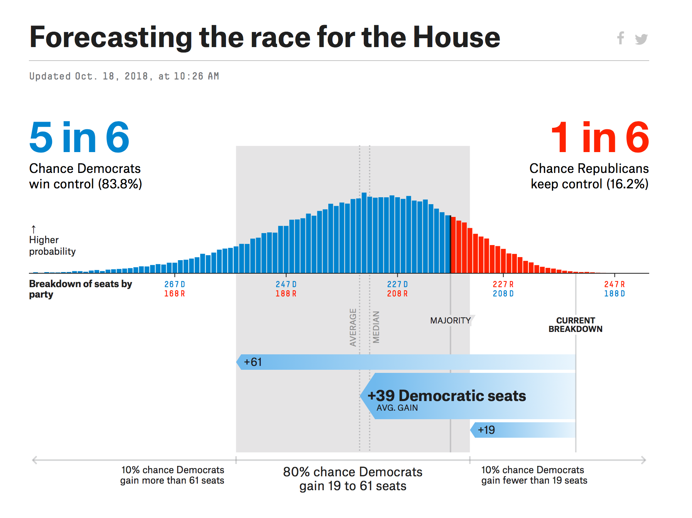
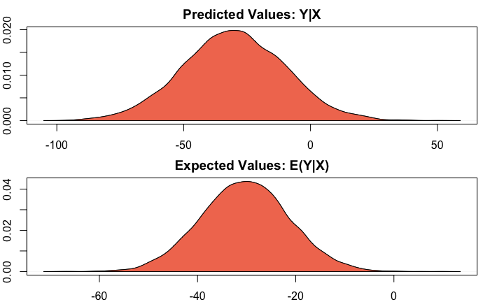
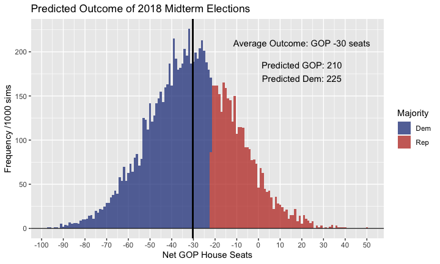

## Today's Plan
- A recap of OLS, simulations, and plotting
- Examine correlates of midterm election results
- merge data frames
- Predict next month's election!
- make a pretty document in markdown

## I Just Wanna Be Like Nate


##Election Data 
Let's load the data about midterm election outcomes and check it out.


```r
Midterms<-read.csv("Midterms.csv")
head(Midterms)
```

```
##   YEAR TERM2              PRESIDENT PARTY APPROVAL HOUSE SENATE HMAJ
## 1 1934     0 Franklin D. Roosevelt      D       NA     9      9    1
## 2 1938     1 Franklin D. Roosevelt      D       60   -71     -6    1
## 3 1942     1 Franklin D. Roosevelt      D       74   -55     -9    1
## 4 1946     0       Harry S. Truman      D       27   -45    -12    1
## 5 1950     1       Harry S. Truman      D       41   -29     -6    1
## 6 1954     0  Dwight D. Eisenhower      R       62   -18     -1    1
```

## Unemployment Data

I got some unemployment data [here.](https://data.bls.gov/pdq/SurveyOutputServlet)
It downloaded as an Excel file, and I cleaned it up a bit before saving as a .csv.


```r
Unemp<-read.csv("BLS_Unemp.csv")
head(Unemp)
```

```
##   Year Jan Feb Mar Apr May Jun Jul Aug Sep Oct Nov Dec
## 1 1948 3.4 3.8 4.0 3.9 3.5 3.6 3.6 3.9 3.8 3.7 3.8 4.0
## 2 1949 4.3 4.7 5.0 5.3 6.1 6.2 6.7 6.8 6.6 7.9 6.4 6.6
## 3 1950 6.5 6.4 6.3 5.8 5.5 5.4 5.0 4.5 4.4 4.2 4.2 4.3
## 4 1951 3.7 3.4 3.4 3.1 3.0 3.2 3.1 3.1 3.3 3.5 3.5 3.1
## 5 1952 3.2 3.1 2.9 2.9 3.0 3.0 3.2 3.4 3.1 3.0 2.8 2.7
## 6 1953 2.9 2.6 2.6 2.7 2.5 2.5 2.6 2.7 2.9 3.1 3.5 4.5
```

## Merging

Before I merge, let's grab only the October column.

```r
Oct_Unemp<-Unemp[names(Unemp)=="Oct" | names(Unemp)=="Year"]
```
Now to merge, you just use the `merge` command:


```r
Midterms2<-merge(Midterms, Oct_Unemp, by.x="YEAR", by.y="Year")
```

*What happened?*

## Some Safety Tips
- You can tell R that you want to keep all of the rows in one data frame or the other, even if there aren't common column values

```r
Midterms2<-merge(Midterms, Oct_Unemp, by.x="YEAR", by.y="Year", all.x = T)
```
- Be very careful about multiple common merge values
- never give your merge output the same name as one of the inputs
- think of some tests that will help you know that the merge worked properly

## Fitting an OLS Model in Zelig

```r
#install.packages("zeligverse")
library(zeligverse)
Z1<-zelig(HOUSE~APPROVAL+Oct, model="ls", data=Midterms2, cite=FALSE)
summary(Z1)
```

```
## Model: 
## 
## Call:
## z5$zelig(formula = HOUSE ~ APPROVAL + Oct, data = Midterms2)
## 
## Residuals:
##     Min      1Q  Median      3Q     Max 
## -28.093 -18.426   6.990   9.931  24.226 
## 
## Coefficients:
##             Estimate Std. Error t value Pr(>|t|)
## (Intercept) -73.8554    30.6015  -2.413   0.0301
## APPROVAL      1.2369     0.4679   2.644   0.0193
## Oct          -2.4706     2.6583  -0.929   0.3684
## 
## Residual standard error: 18.11 on 14 degrees of freedom
##   (4 observations deleted due to missingness)
## Multiple R-squared:  0.3721,	Adjusted R-squared:  0.2824 
## F-statistic: 4.149 on 2 and 14 DF,  p-value: 0.03846
## 
## Next step: Use 'setx' method
```

## Pretty Tables with texreg


<!DOCTYPE HTML PUBLIC "-//W3C//DTD HTML 4.01 Transitional//EN" "http://www.w3.org/TR/html4/loose.dtd">
<table cellspacing="0" align="center" style="border: none;">
<caption align="bottom" style="margin-top:0.3em;">Statistical models</caption>
<tr>
<th style="text-align: left; border-top: 2px solid black; border-bottom: 1px solid black; padding-right: 12px;"><b></b></th>
<th style="text-align: left; border-top: 2px solid black; border-bottom: 1px solid black; padding-right: 12px;"><b>Model 1</b></th>
</tr>
<tr>
<td style="padding-right: 12px; border: none;">(Intercept)</td>
<td style="padding-right: 12px; border: none;">-73.86<sup style="vertical-align: 0px;">*</sup></td>
</tr>
<tr>
<td style="padding-right: 12px; border: none;"></td>
<td style="padding-right: 12px; border: none;">(30.60)</td>
</tr>
<tr>
<td style="padding-right: 12px; border: none;">APPROVAL</td>
<td style="padding-right: 12px; border: none;">1.24<sup style="vertical-align: 0px;">*</sup></td>
</tr>
<tr>
<td style="padding-right: 12px; border: none;"></td>
<td style="padding-right: 12px; border: none;">(0.47)</td>
</tr>
<tr>
<td style="padding-right: 12px; border: none;">Oct</td>
<td style="padding-right: 12px; border: none;">-2.47</td>
</tr>
<tr>
<td style="padding-right: 12px; border: none;"></td>
<td style="padding-right: 12px; border: none;">(2.66)</td>
</tr>
<tr>
<td style="border-top: 1px solid black;">R<sup style="vertical-align: 0px;">2</sup></td>
<td style="border-top: 1px solid black;">0.37</td>
</tr>
<tr>
<td style="padding-right: 12px; border: none;">Adj. R<sup style="vertical-align: 0px;">2</sup></td>
<td style="padding-right: 12px; border: none;">0.28</td>
</tr>
<tr>
<td style="padding-right: 12px; border: none;">Num. obs.</td>
<td style="padding-right: 12px; border: none;">17</td>
</tr>
<tr>
<td style="border-bottom: 2px solid black;">RMSE</td>
<td style="border-bottom: 2px solid black;">18.11</td>
</tr>
<tr>
<td style="padding-right: 12px; border: none;" colspan="3"><span style="font-size:0.8em"><sup style="vertical-align: 0px;">***</sup>p &lt; 0.001, <sup style="vertical-align: 0px;">**</sup>p &lt; 0.01, <sup style="vertical-align: 0px;">*</sup>p &lt; 0.05</span></td>
</tr>
</table>
## Simulate Expected Values


```r
Scen2018 <- setx(Z1, APPROVAL=42.6, Oct=3.7)
Sim1 <- sim(Z1, x = Scen2018, num=10000)
summary(Sim1)
```

```
## 
##  sim x :
##  -----
## ev
##        mean       sd       50%      2.5%     97.5%
## 1 -30.32055 8.982497 -30.32412 -47.94857 -12.65439
## pv
##           mean       sd      50%      2.5%    97.5%
## [1,] -30.25626 20.15125 -30.3721 -69.87375 9.553353
```

## Plot them

```r
par(mar = rep(2, 4))
plot(Sim1)
```

<!-- -->

## Plotting Predictions
<!-- -->

