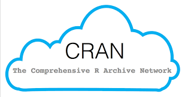

## R Markdown

Welcome back everyone! This is our first R Workshop of the Fall 2018 semester. Our goals for today will be to:

- make sure everyone is up and running using R and R Studio
- to review working directories and packages
- introduce and download materials related to Kosuke Imai's *QSS* book
- play around with data from the race/resume experiment

Download this R Markdown script at: http://www.chesthurber.com/r-workshops

## That Pesky Working Directory

The key commands:


```r
getwd() #find out your current working directory
```

```
## [1] "/Users/cthurber/Documents/Teaching/R Workshops/Refresher"
```

```r
#setwd("C:/Users/A1810667/OneDrive/POLS641_Class_2") #set working directory as another folder (don't use this one, you won't be able to access it!)
#getwd() #what changed?
```

I usually do all working directory stuff in the GUI. Colin argues that this isn't always wise...

## The Apple Store of R




```r
#install.packages("swirl") # install the package, only have to do this once, can be done in GUI
library(swirl) # load the package, do this in every R session! therefore, good to have in your script (not GUI)
```

```
## 
## | Hi! Type swirl() when you are ready to begin.
```

## Make the Robot Talk to Me!

```r
#install_course_github("kosukeimai", "qss-swirl") # install the specific QSS swirl course
swirl() #run the package
bye() # end swirl at any point and return to normal R
```

```
## 
## | Leaving swirl now. Type swirl() to resume.
```

## Loading Datasets

I like working with .csv files. You can download them to R directly from the web, or load them from your working directory.


```r
resume<-read.csv("https://raw.githubusercontent.com/kosukeimai/qss/master/CAUSALITY/resume.csv")

write.csv(resume, "resume.csv")

Resume<-read.csv("resume.csv")
```
*But what did it do here that's kind of funny?*

## Dealing with Infidels (i.e. Stata Users)

It's just as easy as working with .csv files, you just need to load a package. You can use foreign or hazen.


```r
library(foreign)
write.dta(resume, "resume.dta")
RESUME<-read.dta("resume.dta")
```

*Watch out for missing data, though!*

## Let's Play with the Resume Data


```r
summary(resume)
```

```
##    firstname        sex          race           call        
##  Tamika : 256   female:3746   black:2435   Min.   :0.00000  
##  Anne   : 242   male  :1124   white:2435   1st Qu.:0.00000  
##  Allison: 232                              Median :0.00000  
##  Latonya: 230                              Mean   :0.08049  
##  Emily  : 227                              3rd Qu.:0.00000  
##  Latoya : 226                              Max.   :1.00000  
##  (Other):3457
```

## Make a Table


```r
race.call.tab <- table(race = resume$race, call = resume$call)
race.call.tab
```

```
##        call
## race       0    1
##   black 2278  157
##   white 2200  235
```


```r
addmargins(race.call.tab)
```

```
##        call
## race       0    1  Sum
##   black 2278  157 2435
##   white 2200  235 2435
##   Sum   4478  392 4870
```

##Calculate Callback Rates

Overall Callback Rate

```r
sum(race.call.tab[, 2]) / nrow(resume)
```

```
## [1] 0.08049281
```

Callback Rate for Black Names

```r
race.call.tab[1, 2] / sum(race.call.tab[1, ])
```

```
## [1] 0.06447639
```

*Can you calculate the callback rate for White Names?*

##Can I get a Chi-Squared?

A $$\chi^2$$ Test is a statistical test for tabular data. It essentially compares the table we observed with on in which frequencies are evenly distributed by category.


```r
chisq.test(race.call.tab)
```

```
## 
## 	Pearson's Chi-squared test with Yates' continuity correction
## 
## data:  race.call.tab
## X-squared = 16.449, df = 1, p-value = 4.998e-05
```

